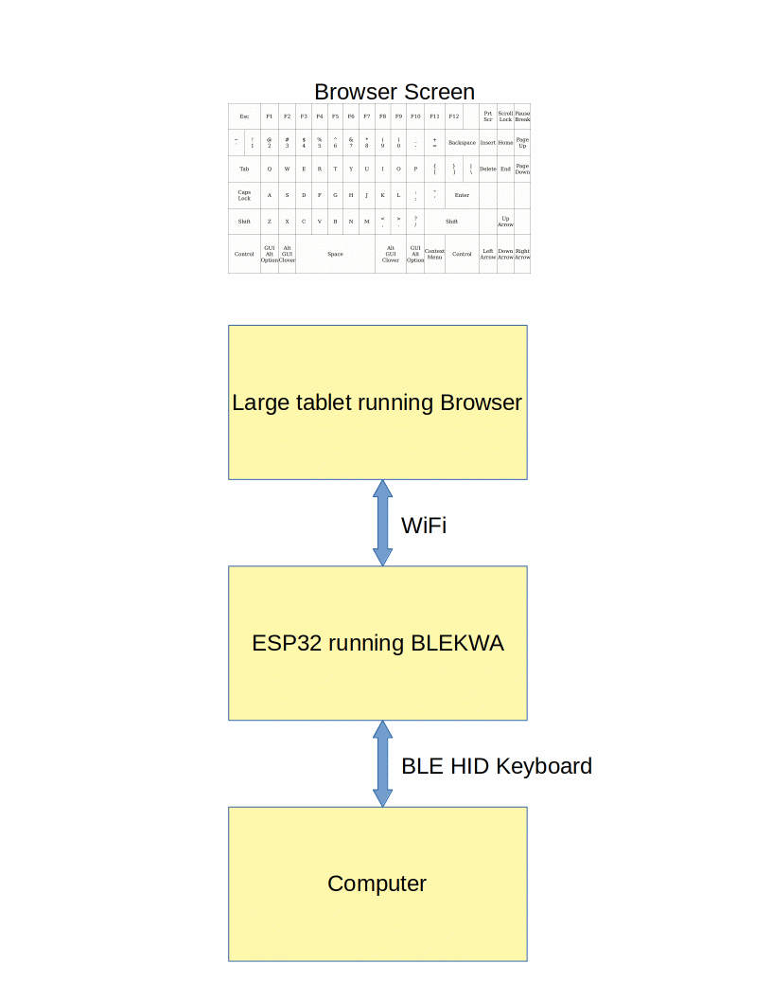

# BLEKWA -- BLE Keyboard Web App

BLEKWA (BLE Keyboard Web App) turns a large tablet or any device with a Web
browser into a BLE keyboard. Anyone having difficulties using a regular
keyboard may find a touch keyboard easier to use.

[Screen capture of keyboard in browser window](./images/Screen_Keyboard.gif)

The keyboard web app displays a 17x6 grid in the browser window. The locations
of touch or mouse events are sent via a web socket back to the ESP32 web
server. The server translates locations to USB HID keycodes and sends them out
the BLE HID keyboard interface.

The ESP32 board is programmed using the Arduino IDE. No soldering is required.
The browser communicates to the ESP32 using WiFi. The ESP32 communicates with
the other computer using Bluetooth Low Energy (BLE).

This program uses the ESP32 NimBLE stack which uses much less RAM and Flash
compared to the older BLE stack. Install NimBLE using the Arduino IDE library
manager.

## Hardware

Any ESP32 board with Bluetooth Low Energy (BLE) should work. As of this
writing, the only ESP32 chip without BLE is the ESP32 S2. The ESP32 C3 has
BLE but is too new to be sure how well it works.
